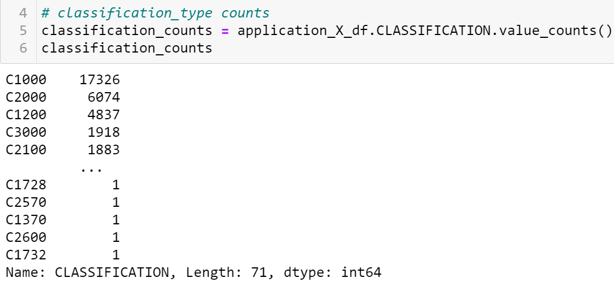

# Neural_Network_Analysis

### **Objectives**

A non profit foundation, Alphabet Soup donates money to many charitable cause such as environment protection, improving health and unifying the world. Alphabet Soup has raised and donated 10 billion dollars in last 20 years. Unfortunately, some of the charity money they donated  are not fruitful since sometimes an organization would take the money and disappear. The objective of this project is help Beks, the data analyst of Alphabet Soup predict which charity organizations are worth donating the money and which ones are high risk. Beks will use mathematical data driven solution to this problem. The data provided is too complicated to use a statistical machine learning process. She will design and train data to a deep learning neural network. The input data will evaluate and train on the input data and make a clear decision making result. Our goal is to help Beks learn about neural networks and how to design and train these models using Python Tensorflow library. The goal is to interpret a large complex dataset and make predictions about charitable organizations that have likely of being successful if funded by Alphabet Soup. 

## **Analysis**

 The purpose of this project is to learn and use neural network in analyzing a complicated multivariable data. The dataset contained more than 34,000 organization information that received funding from Alphabet Soup over the years. We preprocessed the data to make a clean dataset that is readable by neural network and machine learning. We used TensorFlow library which contains the Keras module to build our basic neural network. For our neural network we used two Keras classes, Sequential and Dense. The Sequential Class is a linear stack of neural network layers with data flowing from one layer to the next. The Dense class allows us to add layers within the neural network. Once the Sequential and Dense models are completed, we used Sikit-learn to model-> fit -> predict/transform machine learning to predict the outcome. Within this machine learning, we created a model instance, Split the traning/testing set. Finally the model is used for prediction and transformation. The dataset given in a csv file, *charity_data.csv*, contained information about (1) EIN and NAME (identification columns), (2) APPLICATION_TYPE, (3) AFFILIATION, (4) CLASSIFICATION, (5) USE_CASE, (6) ORGANIZATION, (7) STATUS, (6) INCOME_AMT, (8) SPECIAL_CONSIDERATIONS, (9) ASK_AMT and (10) IS_SUCCESSFUL. Fig 1 shows all dataframe before any preprocessing. We are provided with the starter code, *AlphabetSoupCharity.ipynb* to do the analysis. The data is processed and analyzed the following way for different part of the project. 

**Fig 1:** The original dataframe before any preprocessing.

### **Deliverable 1: Preprocessing the Data for a Neural Network**

We used Jupyter notebook, read the csv file and created a dataframe. We dropped the EIN and NAME from the dataframe because the fitting of the data to determine whether an organization will be successful or not does not depend upon these two variables. The y-value is "IS_SUCCESSFUL". We separated out the dependent y-variable from the independent X-variables in the dataframe. The independent variables were preprocessed the following way:

- **Identify the categorical variables -** We checked the number of unique values in each column (Fig 2) and found that the APPLICATION_TYPE (APP-T) and CLASSIFICATION (CLASS) needed further investigation to reduce the number of variables in fitting the neural network. These column values needs to be binned to reduce the complexity of fitting the data.

- **Preprocessing APPLICATION_TYPE -** Fig 3 shows the values and the plot of the 17 different values of application types (APP-T). The plot shows that APP-T less than 500 counts is a cutoff for binning together as "other". The cumulative value of the "other" value count is shown in Fig 4. 

**Fig 2:** The figure shows the number of unique values found in different columns of the independent variables. 

**Fig 3:** The value counts of the application types shows a large variation of the values. The plot shows the trend of the values to determine which values should be binned into "other".

**Fig 4:** The image shows the value counts of the APP-T after the low counts are binned as others. 

- **Preprocessing CLASSIFICATION -** There are 71 different classification values within the range of  1 and 17,326 as seen in Fig 5. A good cutoff for binning lower values of CLASS appears to be about 1000. I binned the CLASS counts less than 1000 counts as "other". Fig 6 shows the value count of the CLASS column. 

**Fig 5:** The two figures show a large variation of the values of the CLASS. 

**Fig 6:** The image shows the value counts of the CLASS types after binning counts less than 1000 into a group.

- **Encoding the categorical data -** The categorical data is encoded with *OneHotEncoder* since neural network can only process numerical data. This increased nine columns to forty one columns. We then merged the encoded features with the original dataframes to get it ready for the training. Fig 7 shows the resulting dataframe with forty four columns.  

**Fig 7 :** The dataframe with forty four features is ready for training. 

- **Splitting the preprocessed data and scaling it -** The preprocessed data is split into X_train, y_train, X_test and y_test sets for fitting and training data. 

### **Deliverable 2: Compile, Train and Evaluate the Model**

We continued with the *AlphabetSoupCharity.ipynb* after preprocessing it. We created a neural network model by assigning the number of input features and nodes for each layer using Tensorflow Keras. We used two hidden layers and 8 nodes in the first layer and 5 nodes in the second layer. The activation function of the both hidden layers were "relu" and output layer was "sigmoid". The structure of the model is shown in Fig 8. The model is compiled and trained. I ran the model for 100 epochs, but the model reach a stable value by 50 epochs. 

**Fig 8:** The figure shows the summary of the structure of the neural network model.

**Fig 9:** The figure shows the accuracy and loss values of the data that is trained and fitted by neural network. 

#### **Checkpoint and Callback**

I defined the checkpoint path and filename. I created a callback that saved the model's weight. I added the code *save_freq = 5* to save the model's weight every 5 epoch. I am not sure if that worked since the checkpoints folder saved 50 values. A folder, _**checkpoints**_, is created and hdf5 files is saved in the folder.

**Fig 10:** The figure shows the checkpoint callback code.

### **Deliverable 3: Optimize the Model**

The model is optimized for this deliverable. The original accuracy was 0.699 (about 70%) at the end of Deliverable 1. My first attempt in optimization was to automate the process to obtain a set of hyper parameters. The example I saw used **kerastuner**. I could not install kerastuner library in my computer. It generated several errors and interfered with the **_tensorflow_** library originally installed in the computer.  I opted to do the optimization manually. I tried the following modifications to improve the model. For each model I compiled, train and finally evaluated the data. I also plotted the "loss" vs epoch and "accuracy" vs epoch. Most of the time the model reached a stable value after 20 epochs. Therefore, there was no benefit in running more than 30 epochs for most of the trials. For evaluation and testing, the epochs are 30, 50 and 100 (Trial 5 only). 

- **Different activation function -** I tried different activation functions to improve the model. The original model had two hidden layers of "relu". I changed the activation function to two hidden layers of "relu"/"sigmoid" pair (Trial 1), Three "relu" hidden layers (Trial 2), "relu"/"tanh" pair (Trial 3), 3 hidden layers of "LeakyReLU" (Trial 4), and four hidden layers of "LeakyReLU" (Trial 5). I also tried other pairs of activation functions and did not observe any significant change. Trials 1, 2, 3 and 5 have "sigmoid" as the output layer, while Trial 4 has "tanh" as output layer.

- **Different hidden layers and nodes -** The number of hidden layers and nodes make difference in the training of data. I tested  two, three and four hidden layers. The numbers of hidden layers shown currently are not the initial hidden layer of the trials. I stopped at the current numbers of hidden layers after running different combination of the layers and nodes. There was no significant change in the accuracy as I changed the layer and the nodes. Fig 11, 12 and 13 shows the evaluation report, plot of loss, and plot of accuracy for Trial 3 (relu/tanh two hidden layers), Trial 4 (three LeakyReLU layers) and Trial 5 (four LeakyReLU layers). 

**Fig 11:** The three images above show the evaluation report, "loss" plot and "accuracy" plot of **Trial 3**. This trial contained two hidden layers of "relu" activation functions, 30 nodes in layer 1 and 10 nodes in layer 2. The output layer is a "sigmoid" function.

**Fig 12:** The three images above show the evaluation report, "loss" plot and "accuracy" plot of **Trial 4**. This trial contained three hidden layers of "LeakyReLU" activation functions, 30 nodes in layer 1, 15 in layer 2 and 5 nodes in layer 3. The output layer is a "tanh" function.

**Fig 13:** The three images above show the evaluation report, "loss" plot and "accuracy" plot of **Trial 5**. This trial contained four hidden layers of "LeakyReLU" activation functions, 100 nodes in layer 1, 20 in layer 2, 100 nodes in layer 3 and 20 nodes in layer 4. The output layer is a "sigmoid" function.

**Change the binning  -** A proper binning can make difference between a good outcome of a training and poor result. I changed the binning of both APPLICATION_TYPE and CLASSIFICATION. I did not find any significant difference between the tweaks made in the binning. Some binning introduced more noise, while some other binning made the output smooth. 

## **Summary and Conclusion**

The project Neural_Network_Analysis is about training data to neural network and predict an outcome after training the data. A charitable foundation, Alphabet Soup, needs to figure out which charity organizations will benefit the society after receiving money from the foundation. They want to ensure that the money given to a charity is not wasted for future donations. From a dataset of more than 34,000 record we trained the data to predict an outcome. We used TensorFlow library, Sequential and Dense model and finally Sikit-learning before obtaining a final report. I tested and fitted the data to (1) different binning to group the data, (2) different numbers of hidden layers, (3) different number of nodes, (4) different epochs. I was able to make predictions with 72% to 73% accuracy. The trend of fitting showed that there is no obvious magic combination of the fitting that will give better than 75% accuracy. I can tweak the model and maybe obtain a combination. However, time and resources will be better spent if the tweaking could be automated. I could not install _keras tuner_, which is a library that helps pick the optimal set of parameters for the TensorFlow program. As I tried to install this library in my computer, it interfered with the TensorFlow installed to do the rest of analysis. 

The manual tweaking of the parameters did a good job of prediction for our purpose. An accuracy of more than 70% is acceptable in my opinion for a charitable cause. Most of the money will be spent on good cause for humanity and environment. The remaining 30% is not predicted accurately by this model. However, it does not mean all of those will be risky. For an organization with billions of dollar of money, even 1% is a substantial amount. Therefore, an automated tuning of hyperparameter would be worth tweaking the model. 